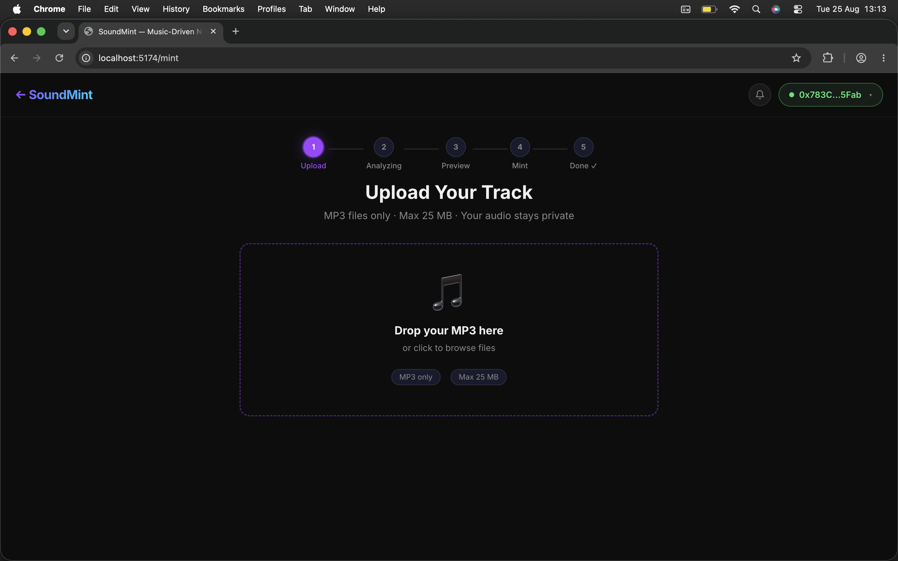
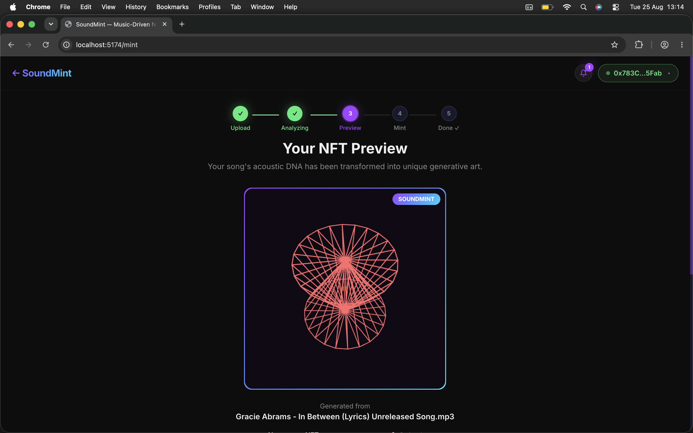
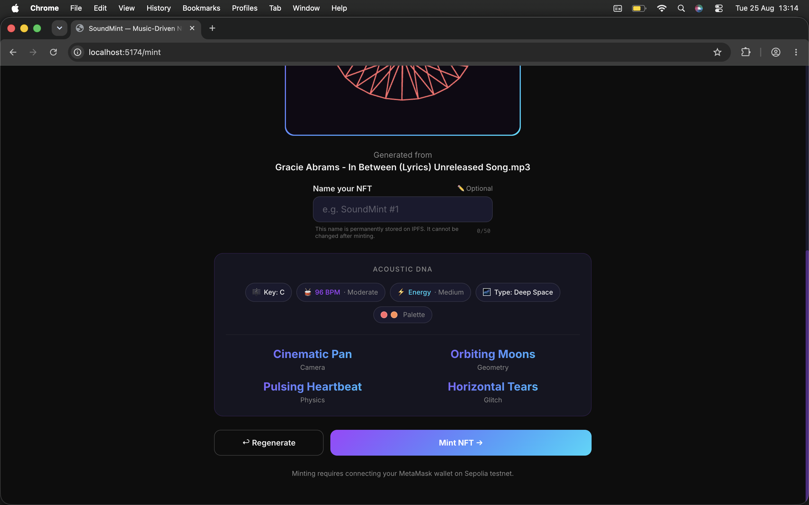
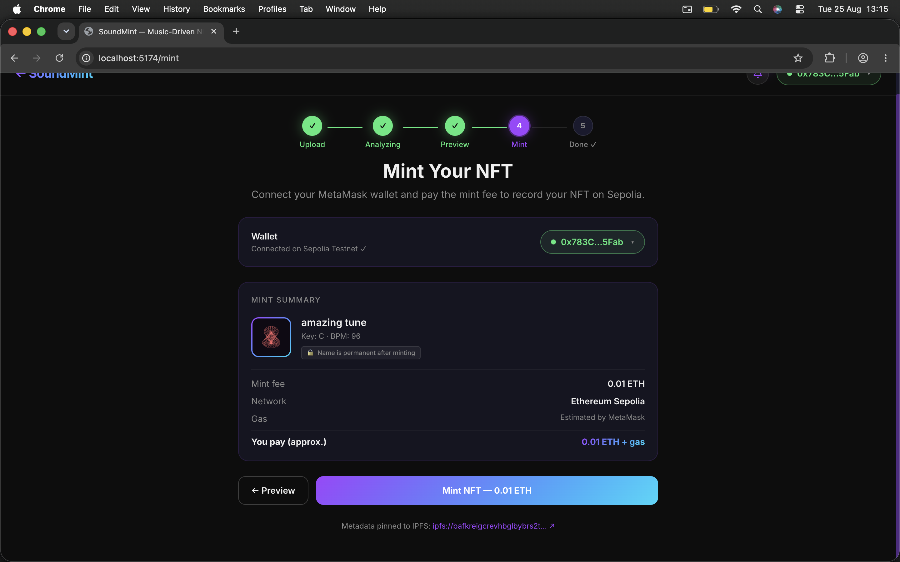
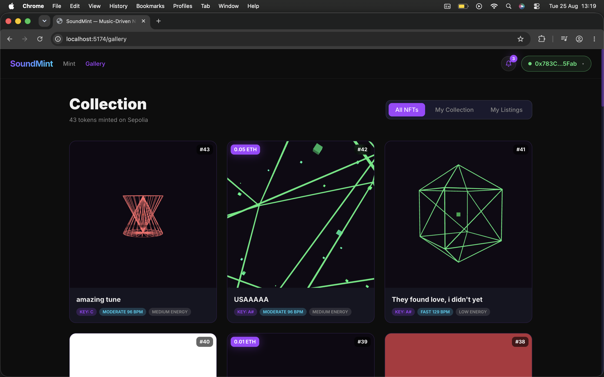
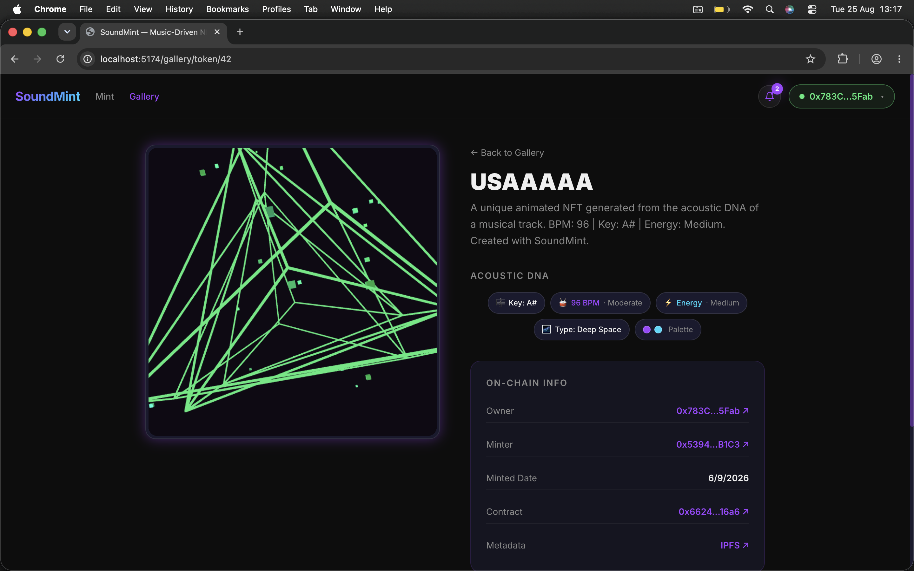

# SoundMint

> Every song has a visual soul. SoundMint reveals it.

SoundMint turns an MP3 into a generative, animated NFT. The application reads the acoustic character of a track, translates those measurements into a visual system, stores the resulting media on IPFS, and records the work as an ERC-721 token on Ethereum Sepolia.

The result is more than cover art. Each token carries an on-chain acoustic identity: tempo, key, energy, brightness, and genre. A built-in gallery makes those works discoverable, playable, and tradable.

## Experience

The workflow is deliberately simple:

1. **Upload a track.** Drop an MP3 into the minting flow. Uploads are limited to 25 MB.
2. **Read its acoustic DNA.** The backend extracts BPM, musical key, RMS energy, spectral features, and an acoustic fingerprint.
3. **Generate the visual.** Those traits drive a P5.js WebGL scene with its own geometry, camera, physics, palette, and motion. The scene is rendered into an animated GIF.
4. **Preview and name it.** Review the artwork and traits, then give the token an optional name.
5. **Pin and mint.** The GIF, audio, and ERC-721 metadata are pinned to IPFS. A wallet transaction mints the token on Sepolia.
6. **Collect and trade.** Browse the collection, inspect on-chain details, listen to the source track, list tokens, buy, or make offers through the escrow marketplace.

## Screenshots

### From sound to visual

<p align="center">
    
    
</p>

<p align="center">
    
    
</p>

### A living collection

<p align="center">
    
    
</p>

## Architecture

```text
React dApp
    |  upload, preview, wallet, gallery, marketplace
    v
FastAPI service
    |-- Librosa + Chromaprint: acoustic analysis and duplicate detection
    |-- Pyppeteer + P5.js: headless generative rendering
    |-- Pillow: animated GIF assembly
    `-- Pinata: IPFS pinning for media and metadata
                    |
                    v
SoundMint.sol on Ethereum Sepolia
    ERC-721 ownership, traits, mint records, and escrow marketplace
```

## Repository Layout

```text
sound-mint/
|-- backend/
|   |-- app/routers/       Upload and session API routes
|   |-- app/services/      Analysis, generation, IPFS, and pipeline services
|   `-- tests/              Backend unit and API tests
|-- frontend/
|   |-- src/pages/         Landing, mint, gallery, and token detail views
|   |-- src/components/    Workflow, wallet, audio, and NFT components
|   |-- src/config/        Sepolia and contract configuration
|   `-- src/hooks/          Token and marketplace data access
|-- contracts/
|   `-- SoundMint.sol       ERC-721 contract and escrow marketplace
`-- screenshots/            Product screenshots used above
```

## Getting Started

### Prerequisites

- Python 3.11 or newer
- Node.js 20 or newer
- A Chromium-compatible browser for Pyppeteer rendering
- MetaMask or another injected wallet configured for Sepolia
- Pinata credentials for IPFS pinning
- Chromaprint, required by `pyacoustid` (`brew install chromaprint` on macOS)

### 1. Start the backend

```bash
cd backend
python -m venv venv
source venv/bin/activate
pip install -r requirements.txt
uvicorn app.main:app --reload --port 8000
```

The interactive API documentation is available at `http://localhost:8000/docs`.

Create a `.env` file in `backend/` with the Pinata credentials used by your account. The backend also accepts `CORS_ORIGINS`, `SESSION_TTL_HOURS`, `SESSIONS_DIR`, `RATE_LIMIT_UPLOADS_PER_HOUR`, and the GIF settings `GIF_WIDTH`, `GIF_HEIGHT`, `GIF_FRAMES`, and `GIF_FPS`. Defaults are defined in [`backend/app/config.py`](backend/app/config.py).

### 2. Start the frontend

```bash
cd frontend
npm install
npm run dev
```

Open `http://localhost:5173`. The frontend talks to the local backend and connects to Ethereum Sepolia through an injected wallet.

### 3. Deploy or configure the contract

`frontend/src/config/contract.js` contains the deployed contract address and ABI. For a new deployment, deploy [`contracts/SoundMint.sol`](contracts/SoundMint.sol) to Sepolia, then update `CONTRACT_ADDRESS` before using the mint flow.

The contract charges `0.01 ETH` by default. It rejects both exact file duplicates (SHA-256) and acoustically equivalent tracks (Chromaprint fingerprint), while storing the audio traits and IPFS metadata URI with each token.

## Technology

| Area                | Technologies                                                                                          |
| ------------------- | ----------------------------------------------------------------------------------------------------- |
| Frontend            | React 18, Vite 5, Tailwind CSS 3, React Router, wagmi, viem, RainbowKit, Framer Motion, WaveSurfer.js |
| Backend             | FastAPI, Uvicorn, Librosa, NumPy, SoundFile, PyAcoustID, Pyppeteer, Pillow, SlowAPI                   |
| Smart contract      | Solidity 0.8.20, OpenZeppelin ERC-721, Ownable, ReentrancyGuard                                       |
| Storage and network | IPFS via Pinata, Ethereum Sepolia testnet (chain ID `11155111`)                                       |

## Useful Entry Points

- [`backend/app/services/pipeline.py`](backend/app/services/pipeline.py) coordinates analysis, generation, pinning, and session status.
- [`backend/app/services/analyzer.py`](backend/app/services/analyzer.py) extracts acoustic features and fingerprints.
- [`backend/app/services/generator.py`](backend/app/services/generator.py) renders the generative scene and assembles the GIF.
- [`backend/app/services/ipfs.py`](backend/app/services/ipfs.py) pins media and metadata.
- [`frontend/src/App.jsx`](frontend/src/App.jsx) defines the application routes.
- [`frontend/src/config/contract.js`](frontend/src/config/contract.js) keeps the frontend ABI and contract address aligned.

## Testing

Run the backend test suite with:

```bash
cd backend
pytest
```

Run the frontend checks with:

```bash
cd frontend
npm run lint
npm run build
```

## Notes

SoundMint currently targets the Ethereum Sepolia testnet. Testnet ETH has no real-world value, and the contract, wallet, IPFS, and browser-rendering prerequisites must all be configured before a complete mint can succeed.
